# UMS CLASS DIAGRAM #

##Overview##
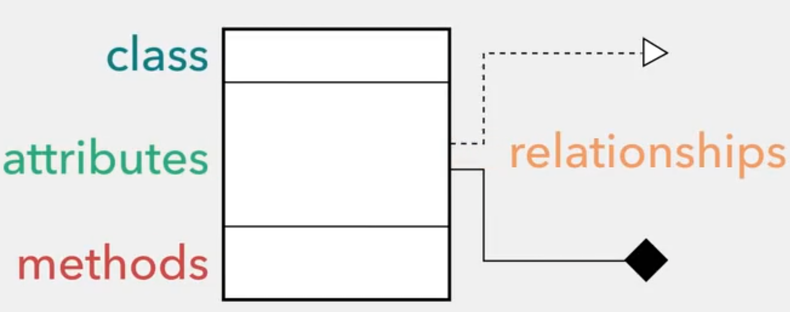

## Attributes & Methodes ##
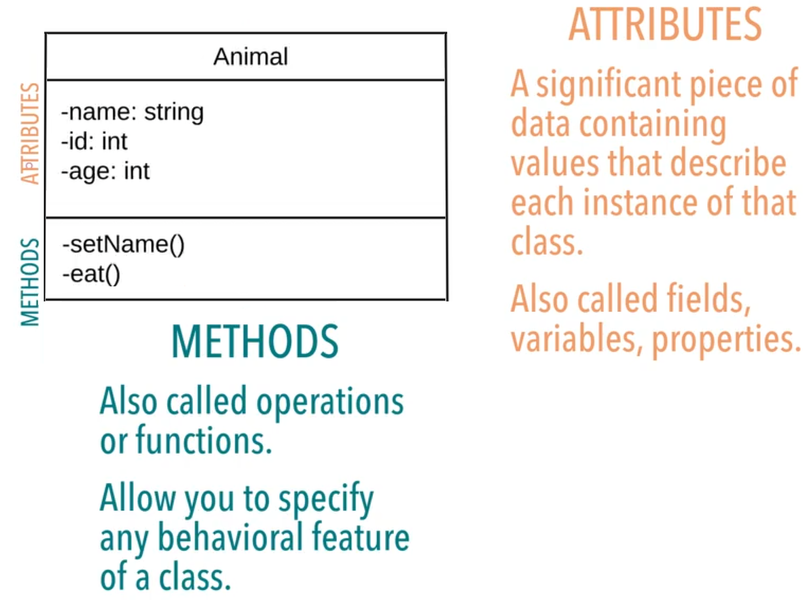

## Visibility ##

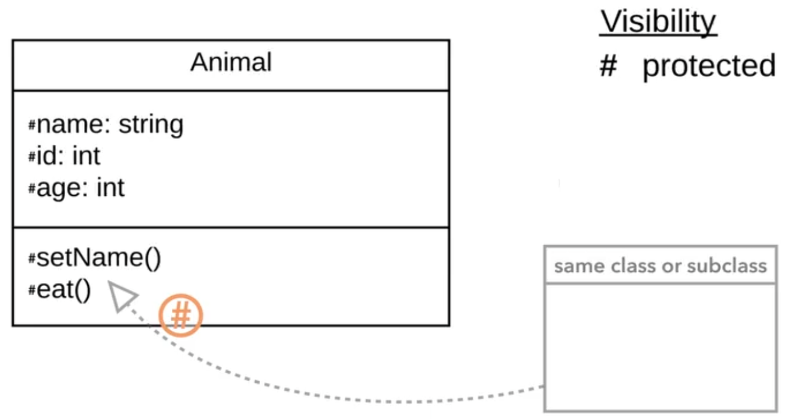

## Relationships ##
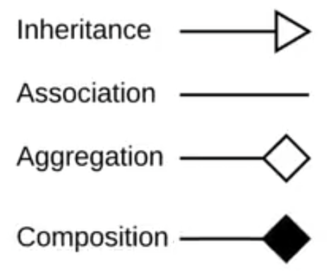

## Inheritance ##
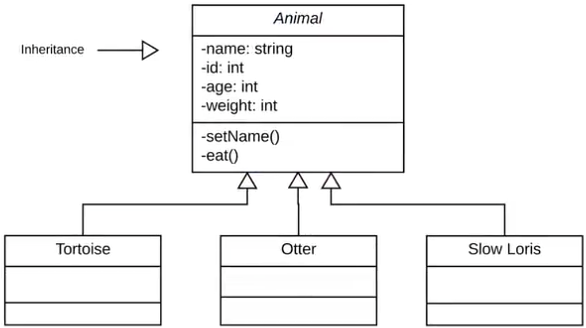

## Association ##
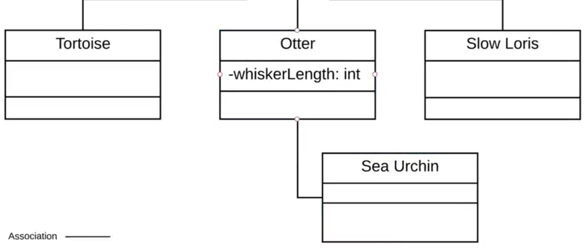

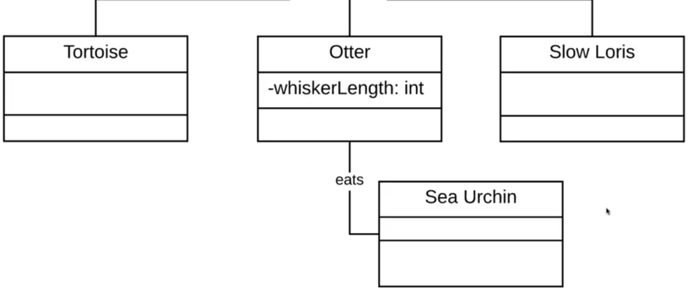

## Aggregation ##
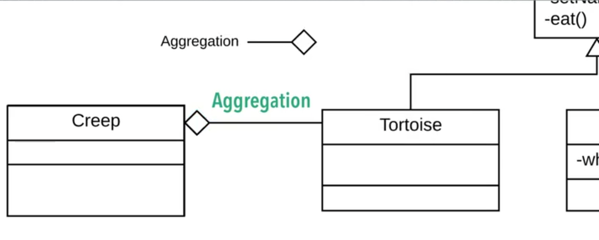

## Composition ##
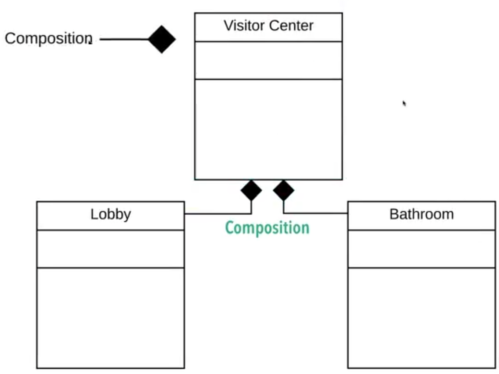
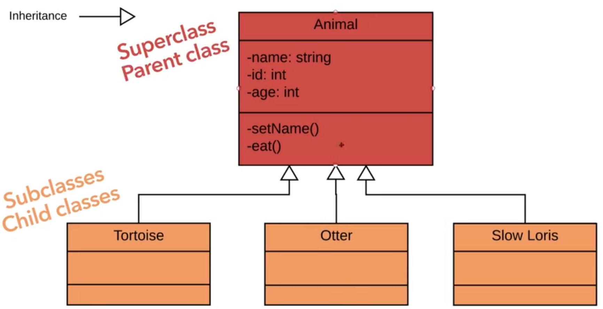
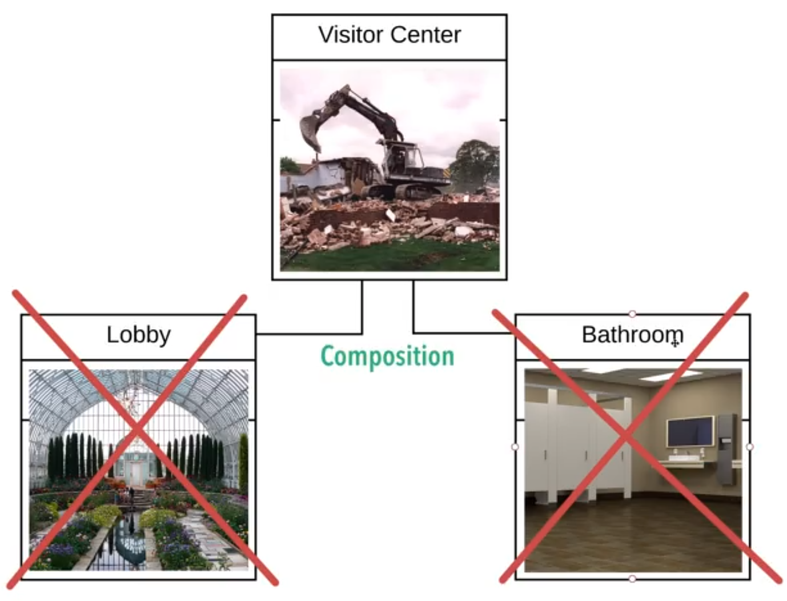

## Multiplicity ##

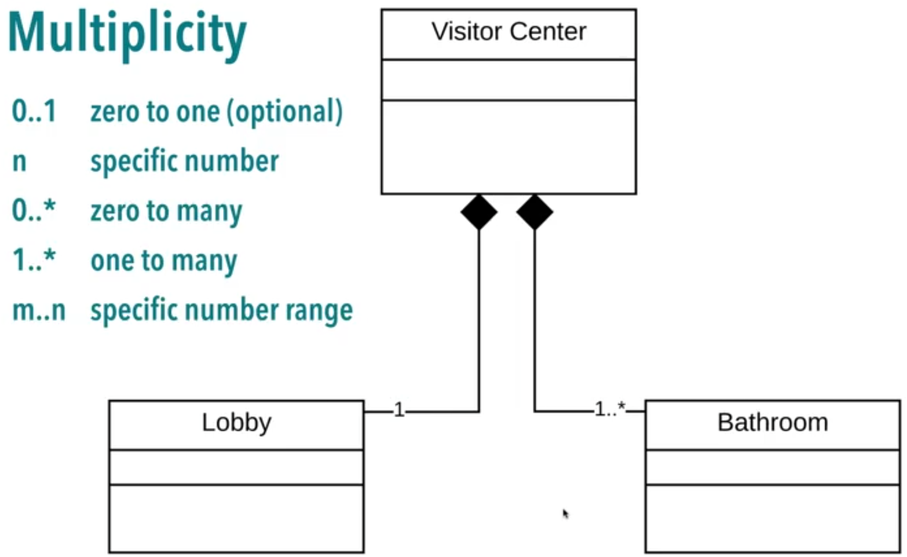

## Sample UML ##
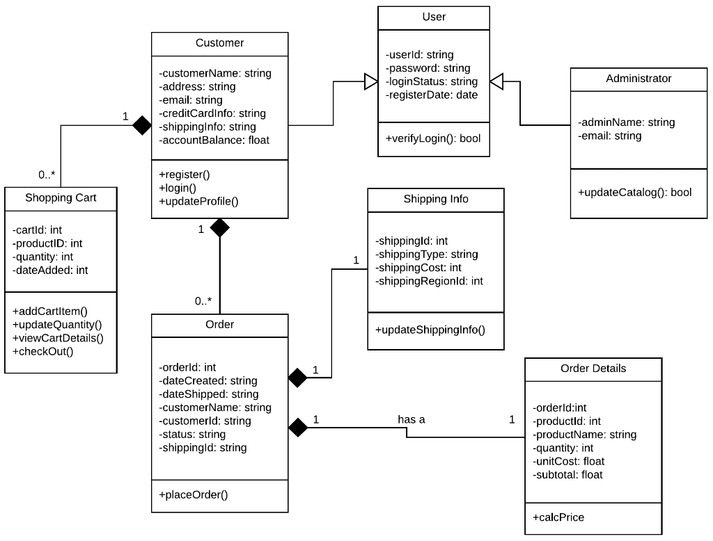
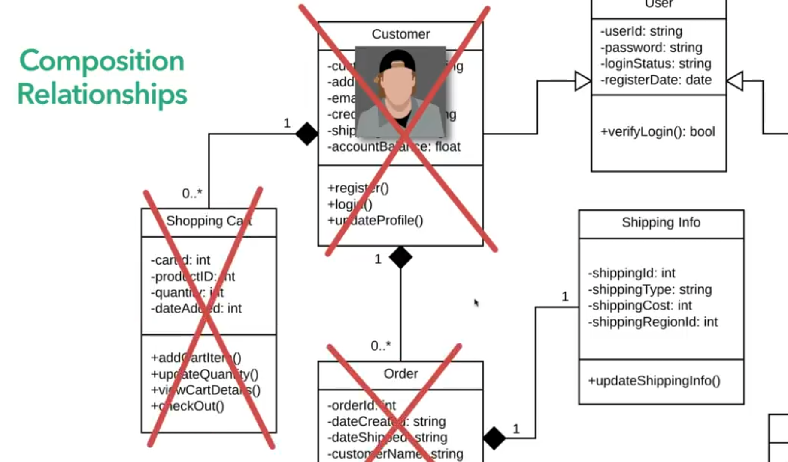
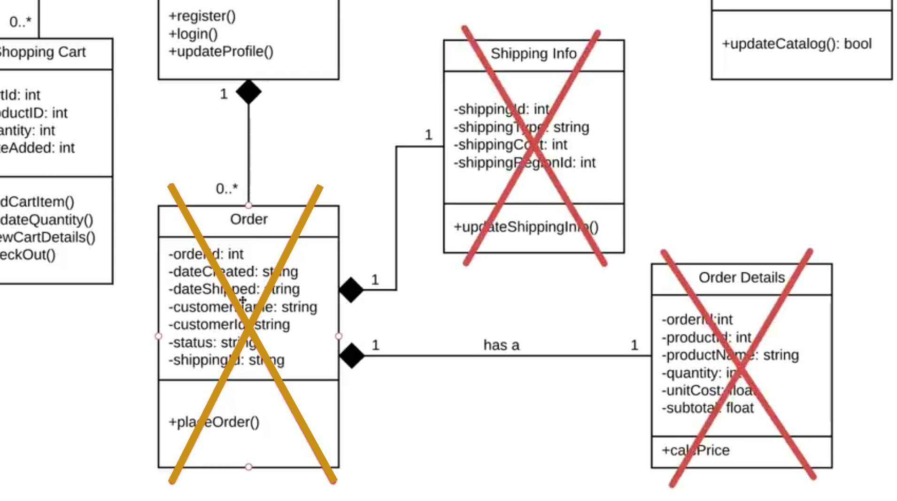
