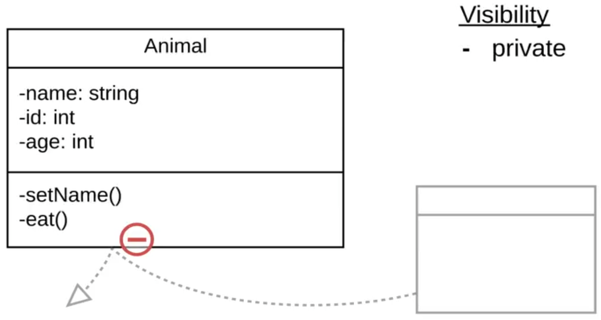
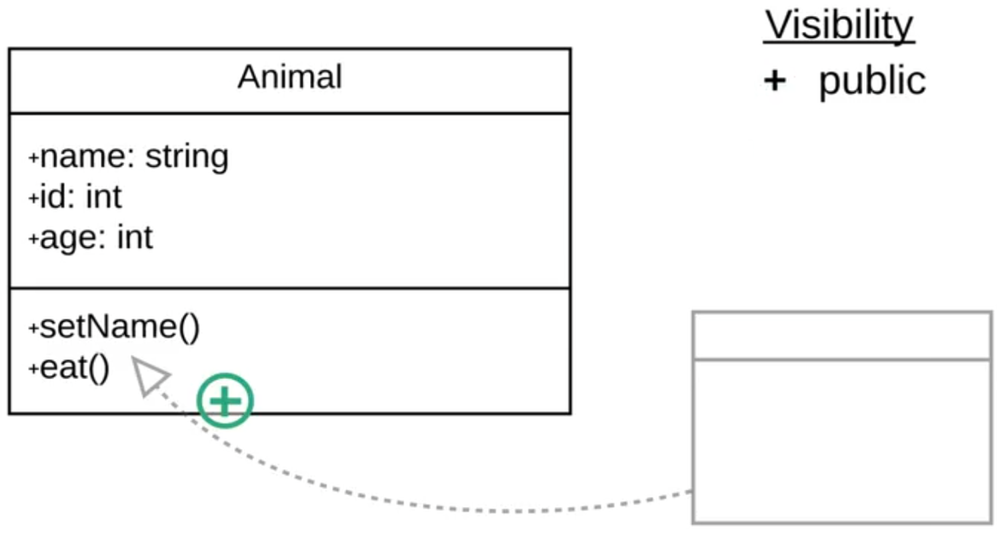
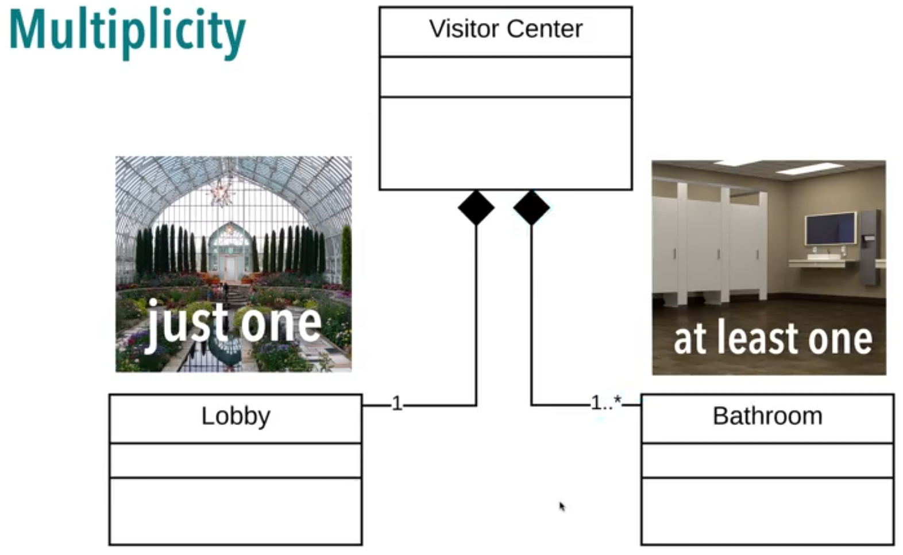
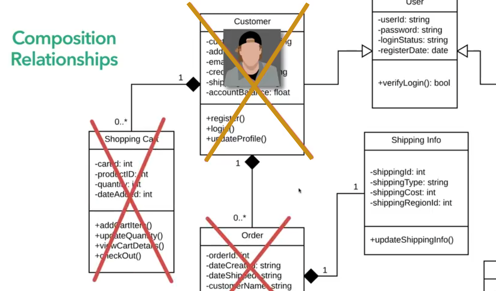

# UMS CLASS DIAGRAM #

##Overview##

## Attributes & Methodes ##

## Visibility ##

## Relationships ##

## Inheritance ##

## Association ##

## Aggregation ##

## Composition ##

## Multiplicity ##

## Sample UML ##

